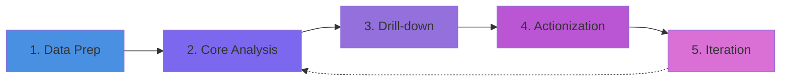
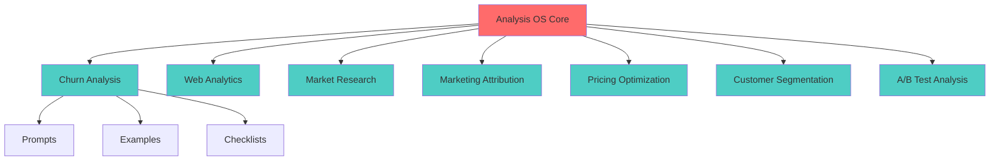
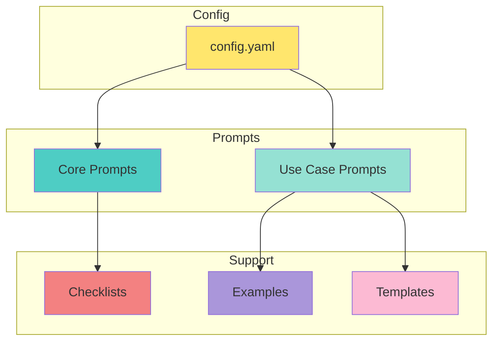
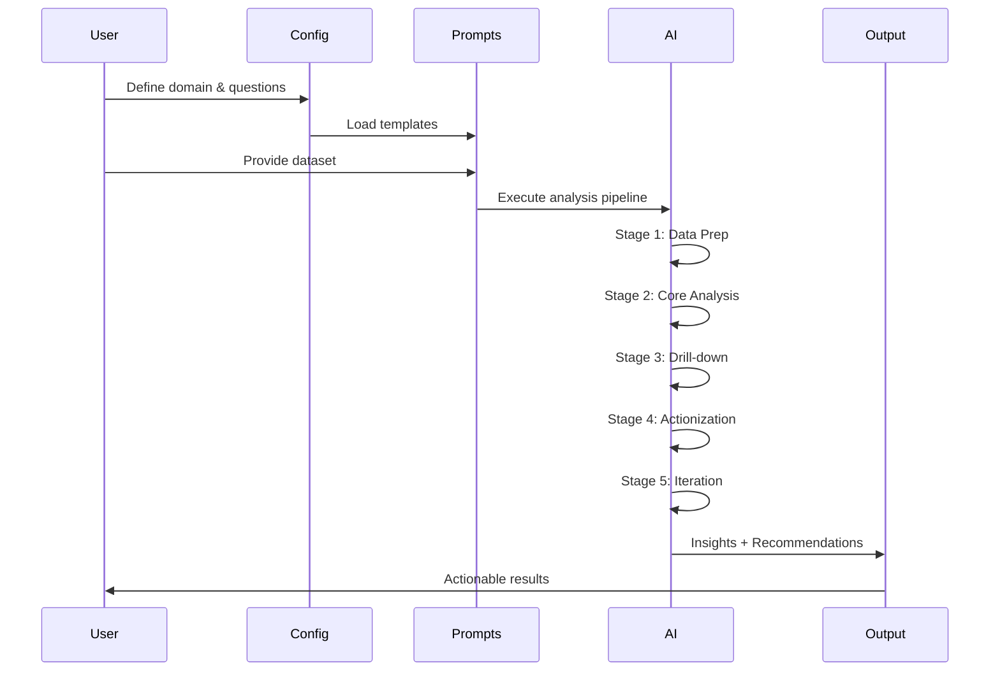

# Analysis & AI Consulting OS - Architecture

## System Overview

The Analysis & AI Consulting OS is a unified framework that transforms ad-hoc data analysis into a structured, repeatable pipeline. The system combines prompt engineering with domain expertise to deliver actionable insights.

## 5-Stage Analysis Pipeline

### Stage 1: Data Preparation
- **Purpose**: Clean and structure raw data
- **Inputs**: Raw datasets, business context
- **Outputs**: Analysis-ready data, quality metrics
- **Prompt**: `prompts/core/data_prep.md`

### Stage 2: Core Analysis
- **Purpose**: Answer primary business questions
- **Inputs**: Prepared data, key questions
- **Outputs**: Insights, trends, patterns
- **Prompt**: `prompts/core/core_analysis.md`

### Stage 3: Drill-down
- **Purpose**: Deep-dive into specific segments
- **Inputs**: Core insights, hypotheses
- **Outputs**: Segment analysis, cohort comparison
- **Prompt**: `prompts/core/drilldown.md`

### Stage 4: Actionization
- **Purpose**: Generate actionable recommendations
- **Inputs**: Insights from stages 1-3
- **Outputs**: Prioritized recommendations
- **Prompt**: `prompts/core/actionization.md`

### Stage 5: Iteration
- **Purpose**: Validate and refine findings
- **Inputs**: Initial recommendations, experiments
- **Outputs**: Validated strategies, test plans
- **Prompt**: `prompts/core/iteration.md`

## Use Case Architecture

## Component Structure

## Data Flow

## Module Integration

Each use case module follows a consistent pattern:

1. **Target Definition**: Clear objective statement
2. **Question Framework**: 3-5 key business questions
3. **Prompt Template**: Domain-specific AI instructions
4. **Quality Checklist**: Validation criteria
5. **Example Output**: Reference implementation

## Technology Stack

- **Configuration**: YAML
- **Prompts**: Markdown with structured sections
- **AI Tools**: ChatGPT, Claude, BigQuery + Claude
- **Visualization**: Python (matplotlib), BI tools
- **Workflow**: Bash scripts, version control (Git)

## Extension Points

1. **Custom Use Cases**: Add new modules in `prompts/use_cases/`
2. **Tool Integration**: Connect to data sources (APIs, databases)
3. **Automation**: Build scheduled analysis pipelines
4. **Collaboration**: Multi-user workflows with shared configs
5. **Reporting**: Generate automated stakeholder reports

## Best Practices

- Always start with data prep to ensure quality
- Use checklists to avoid common analytical pitfalls
- Request evidence/citations for every claim
- Iterate with "why" prompts to drill deeper
- Design experiments before making recommendations
- Document assumptions and limitations

## Performance Characteristics

- **Setup Time**: 10-15 minutes per new use case
- **Analysis Time**: 30-90 minutes per complete pipeline
- **Iteration Cycles**: 2-3 rounds typical
- **Output Quality**: Production-ready with minimal editing

## Security & Privacy

- No sensitive data stored in repository
- API keys managed through environment variables
- Data anonymization recommended for shared examples
- Version control for audit trail

---

**Version**: 1.0  
**Last Updated**: January 2026  
**License**: MIT
